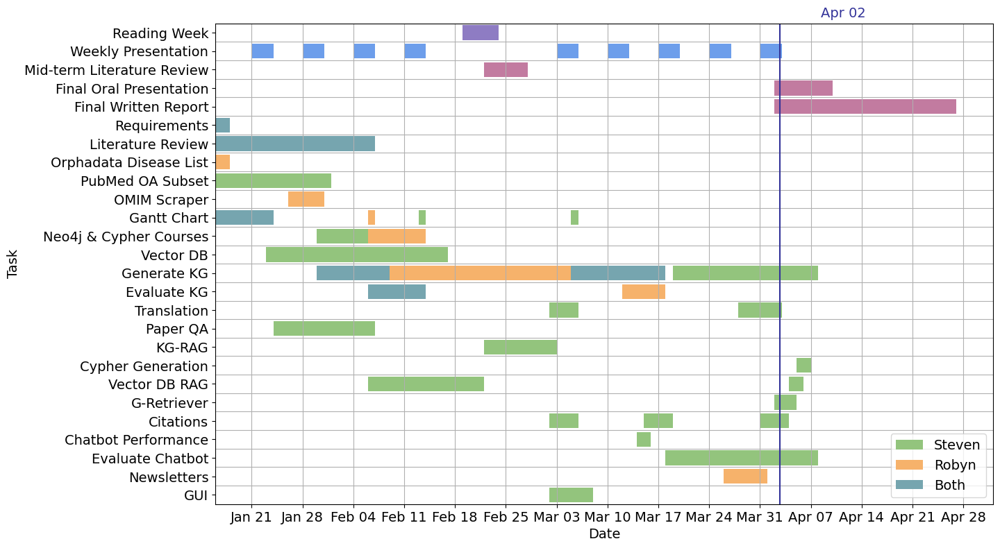

# Ganttcharter



Ganttcharter is a simple tool for creating Gantt charts and tracking progress.
It is used to generate Gantt charts that are to the specifications of the BIOIN
401 weekly presentations.

## Installation

```bash
pip install -r requirements.txt
```
Alternatively, you can use the provided Dockerfile to build a container.

```bash
docker build -t ganttcharter .
```

## Usage
```bash
python ganttcharter.py examples/gantt_chart.csv examples/gantt_chart.png
```

You can also use the provided Dockerfile to run the container.

```bash
docker run -v $(pwd):/app ganttcharter python ganttcharter.py examples/gantt_chart.csv examples/gantt_chart.png
```
